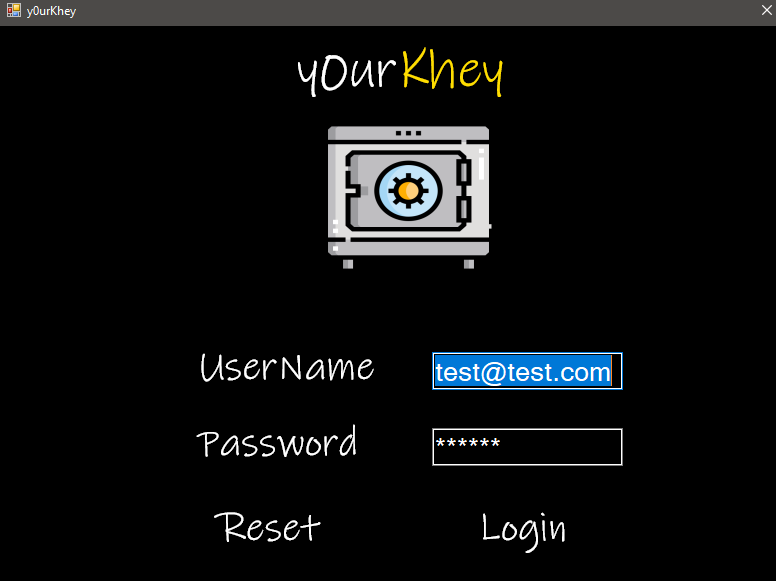
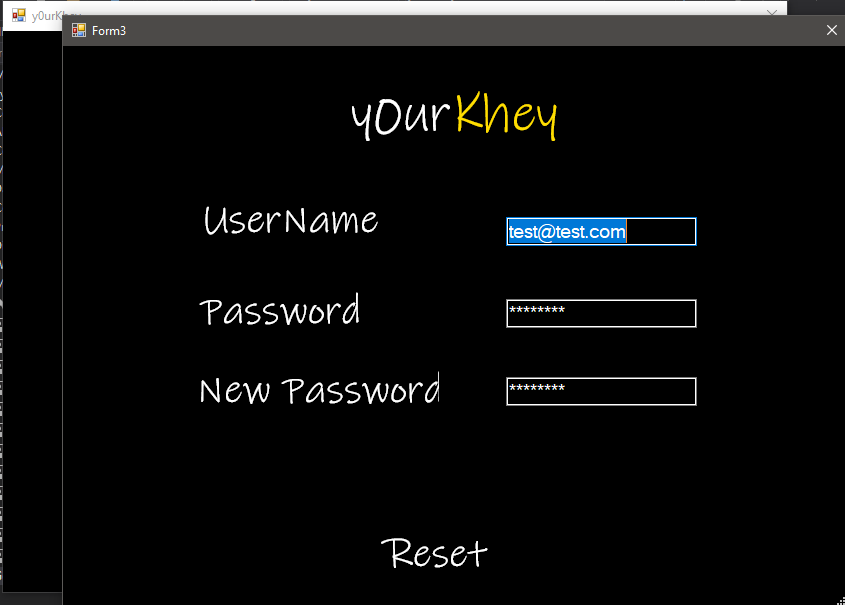
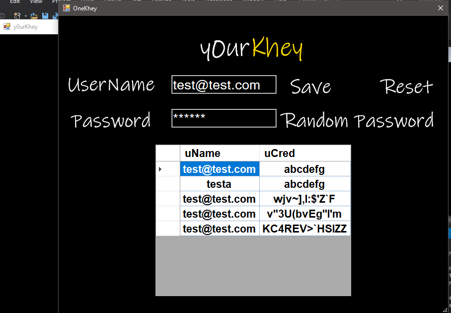

# y0urKhey
simple password manager and generator

## DEFAULT CREDENTIALS ARE:

test@test.com (reset abilities coming soon)

123456 (can be reset in reset menu)

## Installation (only for x64 bit systems currently)

run setup.exe , program will installtal into your system applications 

## Usage

type y0urKhey into your search bar or click setup.exe/y0urKhey.application to launch the program. 

You can store usernames and passwords you want to keep hidden

You can use random password generator to create and store a randomly generated password for you.

## About

Custom encryption algorithm removed from application and replaced with more basic approach to still prevent
credentials from being stored in plain text

## Screenshots

### Login

### Reset

### Main App

## License
[MIT](https://choosealicense.com/licenses/mit/)